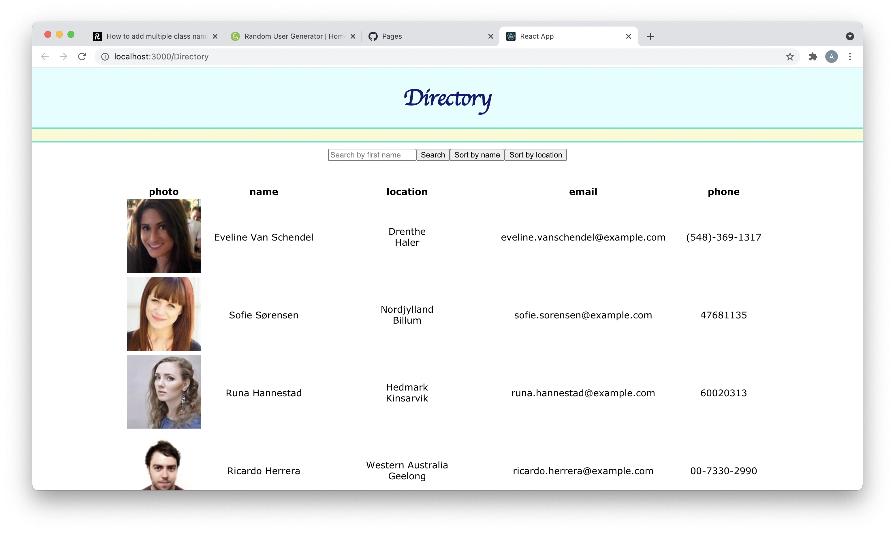

# Directory 

Here you will find a directory of contact information hosted on GitHub Pages. The contact information is from RANDOM USER GENERATOR (https://randomuser.me/) But could be swapped out for real data easily. 

## Installations :

axios : https://www.npmjs.com/package/axios  
react : https://reactjs.org/  
react-dom : https://www.npmjs.com/package/react-dom  
react-router-dom : https://www.npmjs.com/package/react-router-dom   

## Directions :

open your integrated terminal at the package.json file
    run npm i
    run npm run start

your default browser will open at localhost:3000/Directory 

here you will find this page :

the data is randomly generated by an axios call to RANDOM USER GENERATOR (https://randomuser.me/).

you can use the sorting button to sort alphabetically by first name or by home city 

you can also use the search box to search by first name
(try searching by a popular name like Carl for the best results) 

## Recourses :

axios : https://www.npmjs.com/package/axios  
react : https://reactjs.org/  
react-dom : https://www.npmjs.com/package/react-dom  
react-router-dom : https://www.npmjs.com/package/react-router-dom   
RANDOM USER GENERATOR : https://randomuser.me/  
w3schools : https://www.w3schools.com/  
mozilla : https://developer.mozilla.org/en-US/  
stackoverflow : https://stackoverflow.com/  

## GitHub :

https://github.com/austenhughes/Directory

## GitHub Pages :

https://austenhughes.github.io/Directory/

## contact me at :

Email : austen.hughes.91@gmail.com  
github : https://github.com/austenhughes  